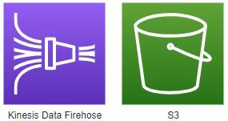
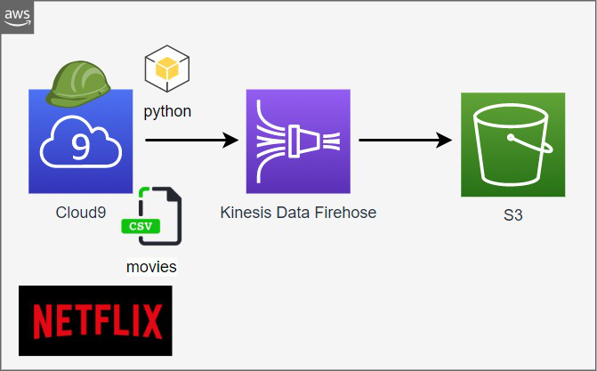
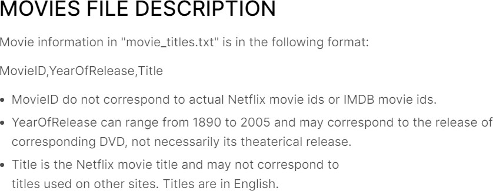

> {width="8.037864173228346in" height="0.7682283464566929in"}
```
# Especialización de Big Data & Analytics en AWS
```
> **Entregable: Kinesis Data Firehose y S3**

{width="3.093993875765529in" height="1.8533333333333333in"}


{width="3.891725721784777in" height="2.060520559930009in"}

## Realizar los siguientes pasos para el ejercicio

> Entrar a Cloud9, crear un programa en Python que lea un archivo csv y envíe todos los registros (fila por fila, bucle iterativo) a un stream de Kinesis Data Firehose, el destino será S3.

{width="4.683173665791776in" height="2.910311679790026in"}

> Caso
>
> Implementar la siguiente arquitectura de flujo de datos en near real time. Actividades a realizar:
> 
> -   Crear un stream en Kinesis Data Firehose que envíe los datos a un bucket de S3.(debe tener el bufer size : 1MB y bufer interval 60 segundos) Para crear los recursos se pide tener una plantilla yaml y usar CloudFormation para la creación de los recursos. **Revisar el workshop de Kinesis Data Firehose**
> 
> -   Crear un programa en python que lea el archivo **movies-netflix.csv** y los agregue al stream de Kinesis Data Firehose. (Usar pandas para leer el csv e iterarlo)
> 
> -   Enviar los datos del DF, dentro de un bule y dormir cada 500 milisegundos por cada envío. Por cada envío mostrar la información leída del Dataframe con el comando print.

## Consideraciones

-   Todos los recursos deben estar en la misma región.

-   Subir el archivo **movies-netflix.csv** a Cloud9.

> Información del dataset
>
> https://[www.kaggle.com/netflix-inc/netflix-prize-data?select=movie_titles.csv](http://www.kaggle.com/netflix-inc/netflix-prize-data?select=movie_titles.csv)
>
> 

{width="4.191393263342082in" height="1.63in"}

> Enviar el programa en Python, el archivo yaml y los pantallazos de la
> ejecución del programa, la creación del Kinesis Data Firehose y el
> contenido de uno de los archivos que se generen en S3.
>
> Especialización de Big Data & Analytics en AWS -- https://bigdataiot.cloud
