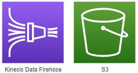
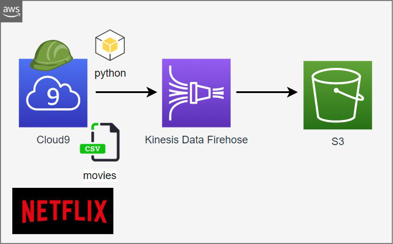
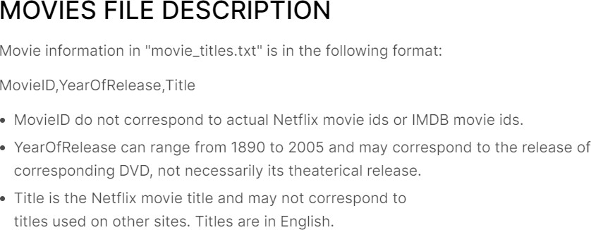

> {width="8.037864173228346in" height="0.7682283464566929in"}
```
***Especialización de Big Data & Analytics en AWS***
```
> **Entregable: Kinesis Data Firehose y S3**

{width="3.093993875765529in" height="1.8533333333333333in"}


{width="3.891725721784777in" height="2.060520559930009in"}


## Requerimiento

### Realizar los siguientes pasos para el ejercicio

> Entrar a Cloud9, crear un programa en Python que lea un archivo csv y envíe todos los registros (fila por fila, bucle iterativo) a un stream de Kinesis Data Firehose, el destino será S3.

{width="4.683173665791776in" height="2.910311679790026in"}

> Caso
>
> Implementar la siguiente arquitectura de flujo de datos en near real time. Actividades a realizar:
> 
> -   Crear un stream en Kinesis Data Firehose que envíe los datos a un bucket de S3.(debe tener el bufer size : 1MB y bufer interval 60 segundos) Para crear los recursos se pide tener una plantilla yaml y usar CloudFormation para la creación de los recursos. **Revisar el workshop de Kinesis Data Firehose**
> 
> -   Crear un programa en python que lea el archivo **movies-netflix.csv** y los agregue al stream de Kinesis Data Firehose. (Usar pandas para leer el csv e iterarlo)
> 
> -   Enviar los datos del DF, dentro de un bule y dormir cada 500 milisegundos por cada envío. Por cada envío mostrar la información leída del Dataframe con el comando print.

### Consideraciones

-   Todos los recursos deben estar en la misma región.

-   Subir el archivo **movies-netflix.csv** a Cloud9.

> Información del dataset
>
> https://[www.kaggle.com/netflix-inc/netflix-prize-data?select=movie_titles.csv](http://www.kaggle.com/netflix-inc/netflix-prize-data?select=movie_titles.csv)
>
> 

{width="4.191393263342082in" height="1.63in"}

> Enviar el programa en Python, el archivo yaml y los pantallazos de la
> ejecución del programa, la creación del Kinesis Data Firehose y el
> contenido de uno de los archivos que se generen en S3.
>
> Especialización de Big Data & Analytics en AWS -- https://bigdataiot.cloud


## Solución

### *Componentes*

*Cloudformation to create the necessary AWS resources and policies used on this exercise*

> - AWS Kineses Firehose
> - AWS S3
> - AWS IAM Role and Policy

```
##
# CloudFormation script created for 'entrega01 assignment'
# Use 'aws cloudformation create-stack --stack-name StackEntrega1Firehose --template-body file://stream_to_firehose_to_s3.yaml --capabilities CAPABILITY_NAMED_IAM'
# to create the stack
# 
# Use 'aws cloudformation delete-stack --stack-name StackEntrega1Firehose' 
# to delete the stack but first run the following command 
# 'aws s3 ls | grep aws-firehose | awk {'print "aws s3 rb s3://" $3 " --force"'}| sh'
#
# to validate run 'aws cloudformation validate-template --template-body file://stream_to_firehose_to_s3.yaml'
#
##
Description: Stack for Firehose DeliveryStream S3 Destination.

AWSTemplateFormatVersion: 2010-09-09

Parameters:
##
# p(parameter)BucketName:
# Specify the default bucket name 
# to receive streams generated by Firehose
##
  pBucketName:
    Description: 'S3 Bucket Name'
    Type: String
    Default: 'aws-kinesis-firehose-deliverystream'

Resources:
##
# r(resource)FirehoseDeliveryStream:
# Firehose created for 'entrega01 assignment'
# to receive streams generated by an ad-hoc
# python program
##
  rFirehoseDeliveryStream:
    DependsOn:
      - rDeliveryPolicy
    Type: AWS::KinesisFirehose::DeliveryStream
    Properties:
      DeliveryStreamName: firehose_to_s3_stream_from_py
      ExtendedS3DestinationConfiguration:
        BucketARN: !Join
          - ''
          - - 'arn:aws:s3:::'
            - !Ref rS3Bucket
        BufferingHints:
          IntervalInSeconds: '60'
          SizeInMBs: '50'
        CompressionFormat: UNCOMPRESSED
        Prefix: data/input/firehose/streams/year=!{timestamp:yyyy}/month=!{timestamp:MM}/day=!{timestamp:dd}/hour=!{timestamp:HH}
        ErrorOutputPrefix: data/input/firehose/error
        RoleARN: !GetAtt rDeliveryRole.Arn
##
# r(resource)rS3Bucket:
# S3 Bucket for receiving delivered streams 
# by Firehose, access granted by rDeliveryRole
##
  rS3Bucket:
    Type: AWS::S3::Bucket
    Properties:
      BucketName: !Join [ -, [ !Ref pBucketName, !Ref AWS::AccountId ] ]
      VersioningConfiguration:
        Status: Enabled
##
# r(resource)DeliveryRole:
# IAM Role to 'Allow' Firehose to 'AssumeRole' 
##
  rDeliveryRole:
    Type: AWS::IAM::Role
    Properties:
      AssumeRolePolicyDocument:
        Version: 2012-10-17
        Statement:
          - Sid: ''
            Effect: Allow
            Principal:
              Service: firehose.amazonaws.com
            Action: 'sts:AssumeRole'
            Condition:
              StringEquals:
                'sts:ExternalId': !Ref 'AWS::AccountId'
##
# r(resource)DeliveryPolicy:
# Policy associated to IAM Role to 'Allow' 
# Firehose several S3 actions 
##
  rDeliveryPolicy:
    Type: AWS::IAM::Policy
    Properties:
      PolicyName: firehose_to_s3_policy
      PolicyDocument:
        Version: 2012-10-17
        Statement:
          - Effect: Allow
            Action:
              - 's3:AbortMultipartUpload'
              - 's3:GetBucketLocation'
              - 's3:GetObject'
              - 's3:ListBucket'
              - 's3:ListBucketMultipartUploads'
              - 's3:PutObject'
            Resource:
              - !Join 
                - ''
                - - 'arn:aws:s3:::'
                  - !Ref rS3Bucket
              - !Join 
                - ''
                - - 'arn:aws:s3:::'
                  - !Ref rS3Bucket
                  - '*'
      Roles:
        - !Ref rDeliveryRole

```

*Python code that open the file, read each record one by one and write one stream message for each reacord in AWS Kinesis Firehose*

```
import pandas
import json
import logging
import time
import boto3
from botocore.exceptions import ClientError


def main():
    """Practice 01 Kinesis Firehose to S3 methods """

    # Assign these values before running the program
    # TODO: for the next version the name of the file should be a parameter
    delivery_stream_name = 'firehose_to_s3_stream_from_py'
    data_file = 'data/movies-netflix.zip'
    firehose_client = boto3.client('firehose')

    # Set up logging
    logging.basicConfig(level=logging.DEBUG,
                        format='%(levelname)s: %(asctime)s: %(message)s')

    # TODO: Should validate If the specified IAM role does not exist, it should be created
    # TODO: Should validate If Firehose doesn't exist, it should be created

    # Read the file using pandas
    record = {}
    df = pandas.read_csv(data_file, compression='zip', sep=',',
                         header=None, names=['MovieID', 'YearOfRelease', 'Title'])
    df['YearOfRelease'] = df['YearOfRelease'].fillna(0.0).astype(int)

    # Mark the start in log
    logging.info('\nPutting records into the Firehose one at a time')

    # Start to iterate through the dataset to get one record
    # TODO: I have to another version to test the batch mode
    for index, row in df.iterrows():
        record = {
            'MovieID': row['MovieID'],
            'YearOfRelease': row['YearOfRelease'],
            'Title':  row['Title']
        }
        try:
            # Put the record into the Firehose stream
            response = firehose_client.put_record(
                DeliveryStreamName=delivery_stream_name,
                Record={
                    'Data': json.dumps(record)
                }
            )
            logging.info(
                '\nData Record sent to Kinesis Data Firehose : \n' + str(Record))
            # TODO: ask Luis Why I have to wait 500ms between each message
            time.sleep(.5)
        except ClientError as e:
            logging.error(e)
            exit(1)

    logging.info('\nAll data has been sent to Firehose stream!\n')


if __name__ == '__main__':
    main()
```
### *Process (From Cloud9)* 

- [ ] validate the stack using *'aws cloudformation validate-template'*

  

- [ ] Create the stack using the command *'aws cloudformation create-stack --stack-name StackEntrega1Firehose --template-body file://firehose_to_s3.yaml --capabilities CAPABILITY_NAMED_IAM'*

  

- [ ] Wait for the creation of the stack

  

- [ ] All set, the stack with all the resources ( Kinesis Firehose, Bucket S3, IAM Role and Policy)

  

  

  

  

- [ ] Start the execution of python program...

  

- [ ] After some time the streams (now s3 objects) start to appears in S3

  

- [ ] Check one of the objects in s3

  
